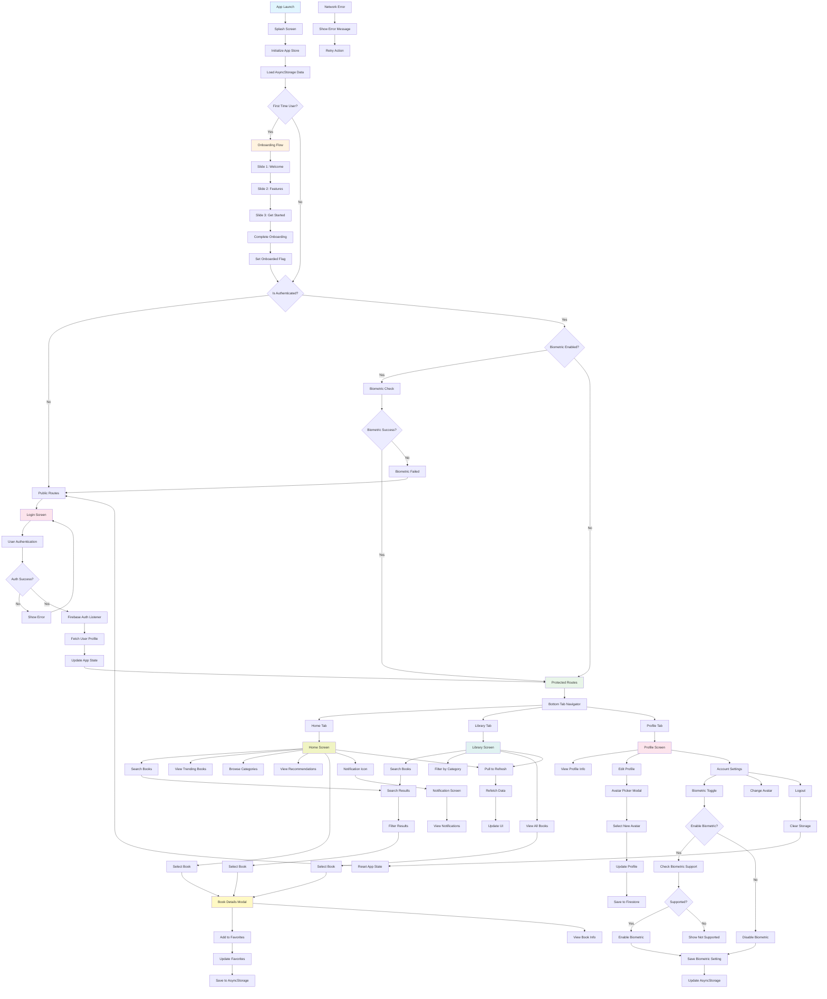

# Bazar App - Complete Application Flow

## Application Architecture:

### **Navigation Structure:**
- **Root Navigator**: Manages app-level routing
- **Public Routes**: Login, Register screens
- **Protected Routes**: Bottom tab navigation
- **Onboarding**: First-time user experience

### **Main Features:**

#### **Home Screen:**
- Search functionality
- Trending books carousel
- Top books of the week
- Vendor recommendations
- Book recommendations
- Pull-to-refresh capability

#### **Library Screen:**
- Book search and filtering
- Category browsing
- Complete book catalog
- Advanced search options

#### **Profile Screen:**
- User profile management
- Avatar customization
- Account settings
- Biometric authentication toggle
- Logout functionality

#### **Book Interaction:**
- Book details modal
- Favorites management
- Book information display
- Add/remove from favorites

### **Data Management:**
- **Zustand Store**: Global state management
- **AsyncStorage**: Local data persistence
- **Firebase Firestore**: User profiles and data
- **React Query**: API data fetching and caching

### **Key User Flows:**

1. **First-time User**: Onboarding → Registration → Home
2. **Returning User**: Splash → Authentication → Home
3. **Book Discovery**: Search → Filter → Select → Details → Favorite
4. **Profile Management**: Profile → Settings → Update → Save
5. **Authentication**: Login → Biometric (optional) → Protected Routes

### **Error Handling:**
- Network error recovery
- Authentication error handling
- Biometric fallback options
- User-friendly error messages