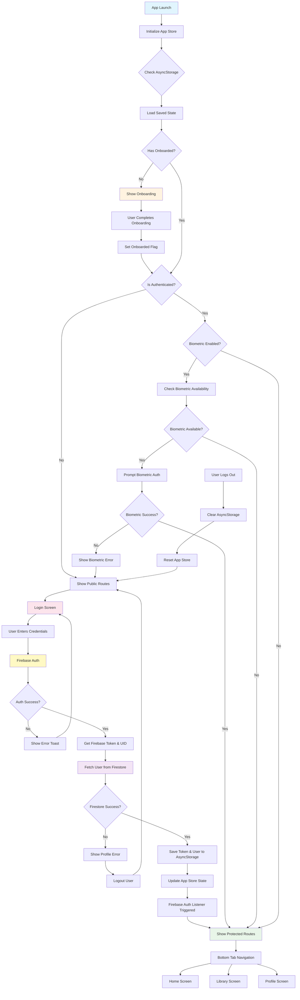

# Bazar App - Authentication Flow

## Key Authentication Components:

1. **App Store (Zustand)**: Manages global authentication state
2. **Firebase Auth**: Handles user authentication
3. **Firestore**: Stores user profile data
4. **AsyncStorage**: Persists authentication state locally
5. **Biometric Auth**: Optional biometric authentication
6. **Auth Listener**: Monitors Firebase auth state changes

## Authentication States:

- **Loading**: App is initializing
- **Onboarding**: First-time user experience
- **Unauthenticated**: User needs to login
- **Authenticated**: User is logged in and can access protected routes

## Security Features:

- Token-based authentication with Firebase
- Biometric authentication support
- Automatic token refresh via Firebase listener
- Secure storage of user credentials